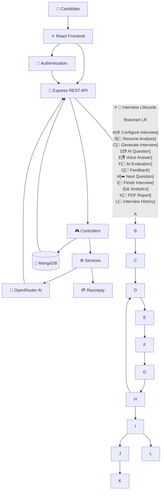
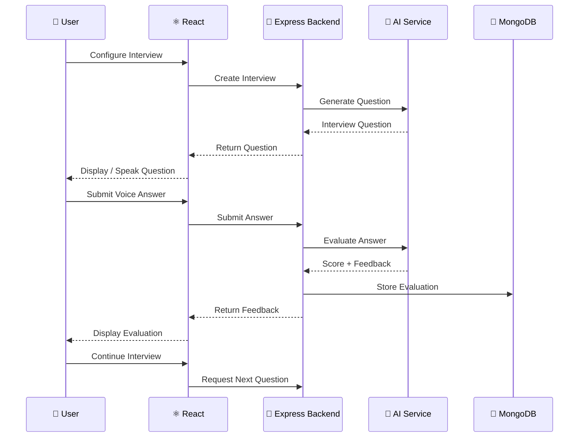
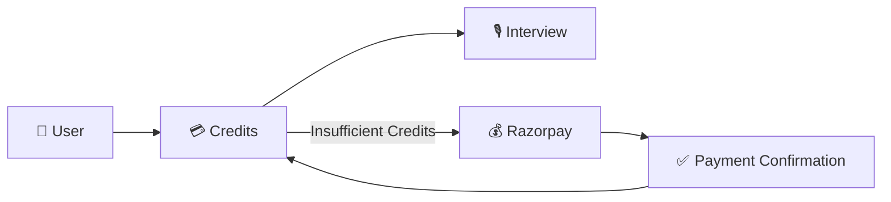
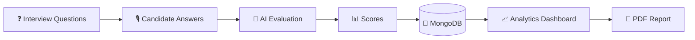

<div align="center">


# HireMate

### AI-Powered Interview Preparation Platform

**Practice realistic interviews • Interact through voice • Get AI-powered feedback • Track your performance**

<br/>


<br/>

**A full-stack AI interview platform built with React, Node.js, Express, MongoDB and modern AI APIs.**

<br/>

[Features](#-features) •
[Architecture](#-architecture) •
[Tech Stack](#-technology-stack) •
[Setup](#-getting-started) •
[Roadmap](#-roadmap)

</div>

---

# 🚀 Overview

**HireMate** is a full-stack AI-powered interview preparation platform designed to simulate realistic **technical and HR interview experiences**.

Instead of relying on static question lists, HireMate creates an interactive interview workflow where candidates can configure an interview, interact with an AI interviewer, answer questions using voice, receive AI-powered evaluation and analyse their performance afterwards.

### What HireMate provides

- 🎯 AI-generated interview questions
- 👔 HR interview mode
- 💻 Technical interview mode
- 📄 Resume-based interview preparation
- 🎙️ Voice-based interview interaction
- ⏱️ Timed interview questions
- 🧠 AI-powered answer evaluation
- 📊 Confidence, communication and correctness analysis
- 📈 Performance analytics
- 📜 Interview history
- 📄 Downloadable PDF reports
- 💳 Credit-based interview system
- 🔐 Firebase + JWT authentication
- 💰 Razorpay payment integration

The project combines **full-stack development, AI integration, browser APIs, authentication, payments, analytics and persistent data storage** into a single application.

---

# ✨ Features

## 🎯 AI-Powered Interviews

HireMate dynamically generates interview questions based on the candidate's interview configuration.

The interview can consider:

- Target role
- Experience level
- Resume information
- Technical skills
- Projects
- Selected interview type

This makes the interview experience more personalised than a traditional static question bank.

---

## 👔 HR Interview Mode

Designed for behavioural and communication-focused preparation.

Examples of evaluation areas include:

- Communication
- Confidence
- Clarity
- Relevance
- Behavioural responses
- Overall answer quality

---

## 💻 Technical Interview Mode

Designed for technical interview preparation based on the candidate's selected role and profile.

The system can generate role-relevant technical questions and evaluate the submitted answers using AI.

---

## 📄 Resume Analysis

Candidates can provide resume information during interview setup.

The system can use information such as:

- Projects
- Technical skills
- Experience
- Relevant technologies

to create a more personalised interview experience.

---

# 🎙️ Voice-Based Interview

One of the core features of HireMate is its browser-based voice interaction.

The interview experience supports:

- 🔊 AI question speech
- 🎤 Speech recognition
- 🗣️ Voice-based answers
- ⏱️ Timed responses
- 🔄 Interactive question-answer flow
- 👨 Male AI interviewer experience
- 👩 Female AI interviewer experience

The goal is to make the interview experience feel closer to an actual interview rather than a traditional form.

---

# 🧠 AI Answer Evaluation

After a candidate submits an answer, HireMate sends the response through the AI evaluation workflow.

The system can provide feedback around:

| Evaluation Area | Description |
|---|---|
| 🎯 Correctness | How accurately the answer addresses the question |
| 💬 Communication | Clarity and quality of communication |
| 🧠 Confidence | Confidence-related evaluation |
| 📌 Relevance | How relevant the answer is |
| ✨ Clarity | Structure and understandability |
| 📝 Answer Quality | Overall response quality |
| 💡 Feedback | Question-specific AI feedback |

---

# 📊 Interview Analytics

After completing an interview, HireMate provides a detailed performance overview.

### Overall Performance

A consolidated performance score for the interview.

### Skill Evaluation

The platform evaluates key areas including:

- Confidence
- Communication
- Correctness

### Performance Trend

A visual representation of performance across interview questions.

### Question-Level Analysis

Each question can include:

- Original interview question
- Candidate answer
- Score
- AI evaluation
- Feedback

### PDF Report

Interview results can be exported through the **Download PDF** functionality.

---

# 📸 Product Showcase

## 🧩 Interview Setup

Candidates can configure their interview before starting.

The setup workflow includes:

- Candidate profile
- Experience
- Interview type
- Resume analysis
- Projects
- Skills
- Interview configuration


---

## 👔 HR & 💻 Technical Interview Modes

HireMate provides different interview experiences depending on the candidate's preparation goal.


---

## 📜 Interview History

Candidates can review their previous interviews and track their progress over time.

History can contain information such as:

- Role
- Experience
- Interview type
- Date
- Overall score
- Completion status


---

## 📈 Analytics Dashboard

The analytics dashboard provides a detailed overview of interview performance.


---

# 🏗️ Architecture

HireMate follows a separated **frontend + backend architecture**.



# 🎙️ AI Interview Flow



---

# 📁 Project Structure

```text
HireMate/
│
├── backend/
│   ├── config/
│   │   ├── connectDb.js
│   │   └── token.js
│   │
│   ├── controllers/
│   │   ├── auth.controller.js
│   │   ├── interview.controller.js
│   │   ├── payment.controller.js
│   │   └── user.controller.js
│   │
│   ├── middlewares/
│   │   ├── isAuth.js
│   │   └── multer.js
│   │
│   ├── models/
│   │   ├── interview.model.js
│   │   ├── payment.model.js
│   │   └── user.model.js
│   │
│   ├── routes/
│   │   ├── auth.route.js
│   │   ├── interview.route.js
│   │   ├── payment.route.js
│   │   └── user.route.js
│   │
│   ├── services/
│   │   ├── openRouter.service.js
│   │   └── razorpay.service.js
│   │
│   ├── public/
│   ├── .env
│   └── index.js
│
├── frontend/
│   ├── public/
│   │
│   ├── src/
│   │   ├── assets/
│   │   ├── components/
│   │   │   ├── AuthModel.jsx
│   │   │   ├── Footer.jsx
│   │   │   ├── Navbar.jsx
│   │   │   ├── Step1SetUp.jsx
│   │   │   ├── Step2Interview.jsx
│   │   │   ├── Step3Report.jsx
│   │   │   └── Timer.jsx
│   │   │
│   │   ├── pages/
│   │   │   ├── Auth.jsx
│   │   │   ├── Home.jsx
│   │   │   ├── InterviewHistory.jsx
│   │   │   ├── InterviewPage.jsx
│   │   │   ├── InterviewReport.jsx
│   │   │   └── Pricing.jsx
│   │   │
│   │   ├── redux/
│   │   │   ├── store.js
│   │   │   └── userSlice.js
│   │   │
│   │   ├── utils/
│   │   │   └── firebase.js
│   │   │
│   │   ├── App.jsx
│   │   ├── App.css
│   │   ├── index.css
│   │   └── main.jsx
│   │
│   ├── .env
│   ├── index.html
│   ├── package.json
│   └── vite.config.js
│
├── screenshots/
│   ├── 03-interview-setup.png
│   ├── 04-interview-modes.png
│   ├── 05-interview-history.png
│   └── 06-analytics-dashboard.png
│
├── hiremate-logo.png
└── README.md
```

---

# ⚙️ Technology Stack

## Frontend

| Technology | Purpose |
|---|---|
| ⚛️ React | Frontend UI |
| ⚡ Vite | Development & build tooling |
| 🛣️ React Router | Client-side routing |
| 🔄 Redux | Global state management |
| 🌐 Axios | API communication |
| 🎨 Tailwind CSS | UI styling |
| 📊 Recharts | Analytics visualisation |
| 🔷 React Icons | UI icons |
| 🔥 Firebase | Authentication |
| 🎙️ Web Speech API | Voice interaction |

## Backend

| Technology | Purpose |
|---|---|
| 🟢 Node.js | Server runtime |
| 🚀 Express.js | REST API |
| 🍃 MongoDB | Persistent database |
| 📦 Mongoose | MongoDB ODM |
| 🔐 JWT | Authentication |
| 📁 Multer | File handling |
| 🧠 OpenRouter | AI integration |
| 💳 Razorpay | Payment processing |

---

# 🔌 Backend API Architecture

```text
/api
│
├── /auth
│   └── Authentication & user access
│
├── /interview
│   └── Interview lifecycle
│
├── /user
│   └── User profile & credits
│
└── /payment
    └── Payment & credit transactions
```

### Request Flow

```text
Client Request
      ↓
    Route
      ↓
 Middleware
      ↓
  Controller
      ↓
   Service
      ↓
Database / External API
      ↓
   Response
```

---

# 🔐 Authentication

HireMate uses authentication mechanisms to protect user-specific functionality.

- 🔥 Firebase authentication
- 🔐 JWT-based backend authentication
- 🛡️ Protected routes
- 👤 User-specific interview history
- 💳 User-specific credits
- 🔒 Secure API access

---

# 💳 Credit & Payment System

HireMate includes a credit-based system for managing interview usage.



---

# 📊 Analytics Pipeline



---

# 🛠️ Engineering Highlights

### Full-Stack Architecture

Separated frontend and backend layers allow each side to evolve independently.

### AI Service Isolation

AI functionality is handled through backend services rather than exposing provider-specific implementation directly inside the frontend.

### Voice Interaction

Browser speech APIs are combined with the AI interview workflow to create a conversational interview experience.

### Persistent Data

Interview sessions, evaluations, scores and user information are persisted using MongoDB.

### Modular Backend

Controllers, routes, services, models and middleware are separated into dedicated modules.

### Analytics

Interview results are transformed into structured performance metrics and visualised through charts and skill indicators.

### Payment Integration

Razorpay integration enables the credit system to support premium interview usage.

### PDF Reporting

Interview performance can be exported through downloadable PDF reports.

---

# 🧩 Interview State Management

```text
Interview Setup
      ↓
Question Generated
      ↓
Question Displayed / Spoken
      ↓
Listening
      ↓
Answer Captured
      ↓
Answer Submitted
      ↓
AI Evaluation
      ↓
Feedback Displayed
      ↓
Next Question
      ↓
Interview Completed
      ↓
Analytics & Report
```

---

# 🛠️ Key Engineering Challenges

## 🧠 AI Response Handling

AI-generated interview questions and evaluations need to be converted into predictable application data before being consumed by the frontend.

**Approach:** AI interaction is isolated inside a dedicated backend service layer.

## 🎙️ Voice Recognition

Browser speech recognition can behave differently across browsers and environments.

**Approach:** The interview interface manages speech recognition state, answer submission and interview progression directly inside the interview workflow.

## 📊 Persistent Interview History

Every completed interview needs to remain accessible after the session ends.

```text
Interview
    ↓
Evaluation
    ↓
MongoDB
    ↓
Interview History
    ↓
Analytics
    ↓
PDF Report
```

---

# 📋 Product Capability Matrix

| Capability | Status |
|---|:---:|
| AI-generated questions | ✅ |
| Technical interviews | ✅ |
| HR interviews | ✅ |
| Voice interaction | ✅ |
| Resume analysis | ✅ |
| AI answer evaluation | ✅ |
| Confidence evaluation | ✅ |
| Communication evaluation | ✅ |
| Correctness evaluation | ✅ |
| Interview history | ✅ |
| Analytics dashboard | ✅ |
| Performance trends | ✅ |
| Question-level feedback | ✅ |
| PDF reports | ✅ |
| Authentication | ✅ |
| Credit system | ✅ |
| Razorpay integration | ✅ |
| MongoDB persistence | ✅ |

---

# 🚀 Getting Started

## Clone the Repository

```bash
git clone https://github.com/fitbitgaming-lgtm/INTERviewiq.git
cd INTERviewiq
```

## Install Backend

```bash
cd backend
npm install
```

## Install Frontend

Open another terminal:

```bash
cd frontend
npm install
```

---

# 🔑 Environment Variables

### Backend `.env`

```env
MONGODB_URI=your_mongodb_connection_string
JWT_SECRET=your_jwt_secret
OPENROUTER_API_KEY=your_openrouter_api_key
RAZORPAY_KEY_ID=your_razorpay_key
RAZORPAY_KEY_SECRET=your_razorpay_secret
```

### Frontend `.env`

```env
VITE_FIREBASE_API_KEY=your_key
VITE_FIREBASE_AUTH_DOMAIN=your_domain
VITE_FIREBASE_PROJECT_ID=your_project_id
VITE_FIREBASE_STORAGE_BUCKET=your_bucket
VITE_FIREBASE_MESSAGING_SENDER_ID=your_sender_id
VITE_FIREBASE_APP_ID=your_app_id
```

> ⚠️ Never commit real API keys, database credentials or secrets to GitHub.

---

# ▶️ Running Locally

### Backend

```bash
cd backend
npm run dev
```

### Frontend

```bash
cd frontend
npm run dev
```

Then open the local Vite URL shown in your terminal.

---

# 🔄 Complete User Journey

```text
             👤 User
                │
                ▼
        🔐 Sign Up / Login
                │
                ▼
        ⚙️ Interview Setup
                │
                ▼
          📄 Resume Analysis
                │
                ▼
       👔 HR / 💻 Technical
                │
                ▼
          🎙️ Start Interview
                │
                ▼
          ❓ AI Question
                │
                ▼
          🎤 Voice Answer
                │
                ▼
         🧠 AI Evaluation
                │
                ▼
           💬 Feedback
                │
                ▼
          ➡️ Next Question
                │
                ▼
         🏁 Finish Interview
                │
                ▼
          📊 Analytics
             /     \
            ▼       ▼
       📄 PDF    📜 History
```

---

# 🎯 Why HireMate?

Traditional interview preparation often relies on static question lists and self-evaluation.

HireMate focuses on creating a more interactive preparation workflow.

### Traditional Preparation

```text
Question List
     ↓
Candidate Answer
     ↓
Self Evaluation
```

### HireMate

```text
Candidate Profile
      ↓
Personalised Interview
      ↓
AI Question
      ↓
Voice Answer
      ↓
AI Evaluation
      ↓
Performance Analytics
      ↓
Historical Tracking
```

---

# 📚 What This Project Demonstrates

### Frontend Engineering

React • Vite • Routing • Redux • State Management • Component Architecture • Responsive UI

### Backend Engineering

Node.js • Express • REST APIs • Controllers • Services • Middleware

### Database Engineering

MongoDB • Mongoose • Persistent Data Models

### AI Engineering

AI APIs • Prompt-driven workflows • AI Evaluation • Personalised Questions

### Browser APIs

Speech Recognition • Speech Synthesis • Voice Interaction

### Authentication

Firebase • JWT • Protected APIs

### Payments

Razorpay • Credit Management

### Data Visualisation

Charts • Performance Metrics • Skill Evaluation

---

# 🔮 Roadmap

- [ ] More advanced adaptive questioning
- [ ] Industry-specific interview templates
- [ ] More detailed speech analytics
- [ ] Advanced resume parsing
- [ ] Interview comparison across multiple sessions
- [ ] Role-specific evaluation frameworks
- [ ] Recruiter / interviewer dashboard
- [ ] Real-time collaborative interviews
- [ ] More detailed AI coaching
- [ ] Cloud deployment and monitoring
- [ ] Automated CI/CD pipeline

---

# 👨‍💻 Developer

<div align="center">

## Aryan Jaiswal

**B.Tech Computer Science Engineering**

Full-Stack Developer • AI Engineer • Problem Solver

Building practical applications at the intersection of **Software Engineering and AI**.

</div>

---

# ❤️ Thank You

<div align="center">

### If you've made it this far, thank you for taking the time to explore HireMate.

**I truly appreciate your interest. 🚀**

<br/>

⭐ **If you found the project interesting, consider giving the repository a star.**

<br/>

**Built with ❤️ and lots of debugging.**

### HireMate

</div>
